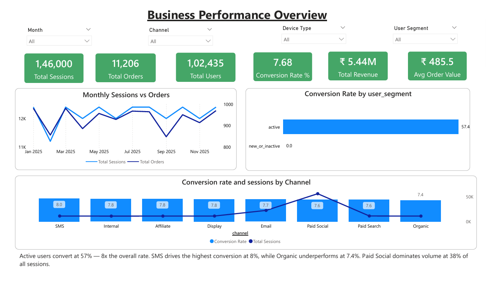
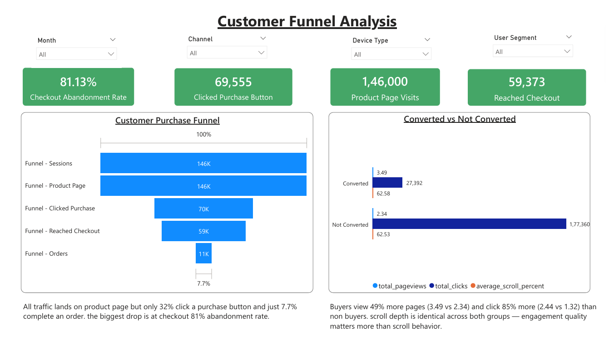
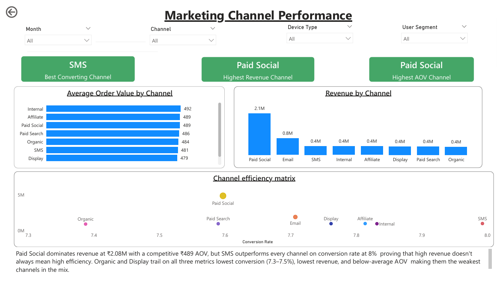
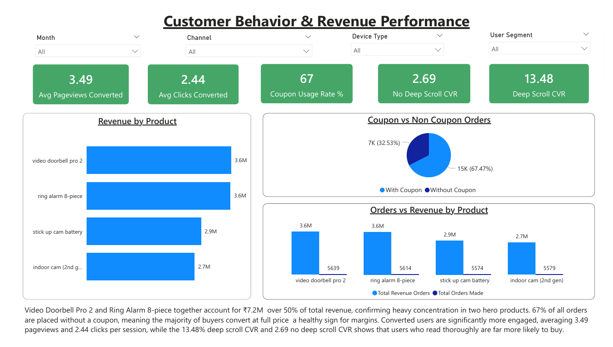
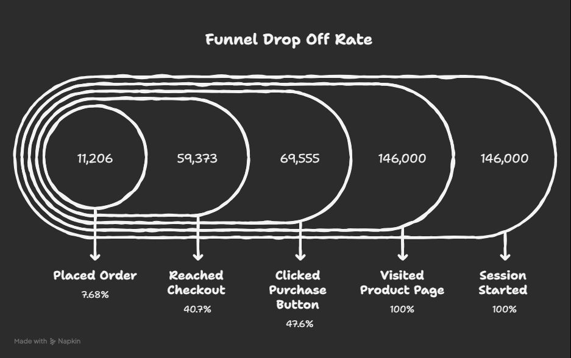

# SmartNest  User Funnel Analytics
## 🏠 Project Overview
End to end product analytics project analyzing 146,000 sessions across 8 event level tables for a smart home e-commerce business. The project covers data cleaning in Python, SQL based table joins, funnel analysis, channel performance, behavioral segmentation and an interactive Power BI dashboard.

##  Problem Statement
SmartNest Home Solutions sells four hardware products — Video Doorbell Pro 2, Ring Alarm 8-piece, Stick Up Cam Battery and Indoor Cam 2nd Gen — across multiple digital acquisition channels. Despite generating 146,000 sessions and $5.4M in annual revenue, only 7.68% of website visitors complete a purchase.

Leadership needed clarity on:
1. where users are dropping off before purchasing
2. which channels are delivering real value
3. what behavioral signals predict purchase intent
4. what changes could meaningfully improve conversion rate and revenue

## ❓ Key Business Questions

1. How do users typically move through the website?
2. Where are the biggest drop off points before purchase?
3. How does behavior differ between sessions that convert versus those that don't?
4. Which marketing channels drive the most valuable traffic?
5. Are there early behavioral signals — such as clicks or scroll depth — that predict purchase intent?

## 📊 Power BI Dashboard

Page 1 — 
Page 2 — 
Page 3 — 
Page 4 — 

## 📊 Dataset Overview

The analysis is based on **8 event-level datasets**:

| Dataset Name              | Description |
|--------------------------|------------|
| user_table               | User identity & purchase history |
| session_table            | Session-level data (channel, device) |
| pageview_table           | Page views per session |
| click_table              | User click interactions |
| scroll_table             | Scroll depth tracking |
| add_to_cart_table        | Add-to-cart events |
| order_table              | Order-level transactions |
| order_line_item_table    | Product-level purchase data |

## 🛠️ Tools Used
1. Python (pandas, numpy) for data cleaning and analysis
2. SQL (SQLite)for joining tables into master tables
3. Power BI for interactive dashboard and visualization

## 🧹 Data Cleaning — Python
All 8 tables were cleaned individually in Python. Each table was checked for:
1. duplicate rows removed based on primary key
2. invalid UUID format IDs dropped — bad IDs silently break all joins
3. datetime columns converted from string using format='mixed'
4. all string columns stripped and lowercased
5. zero and negative prices and quantities dropped
6. missing values imputed only where relevant to funnel analysis

Created derived columns:
1.user_segment
2.page_category
3.cart_value
4.net_revenue
5.is_converted

## 🔗 Joining Tables — SQL (SQLite)
Three master tables were built using SQL to combine the cleaned data into analysis ready formats. LEFT JOIN was used throughout to preserve all sessions including non converted ones.
1. Session Master :session + user + order
one row = one session
used for funnel analysis, channel performance and conversion tracking
2. Behavior Master :pageview + click + scroll
one row = one session with aggregated behavior metrics
used for behavioral analysis and purchase intent signals
3. Order Master :order + order_line_item + session
one row = one product in one order
used for revenue analysis and product performance

## 📈 Funnel Analysis & Key Findings

---

### 🔻 Funnel Drop-Off

| Stage                    | Sessions | % of Total |
|--------------------------|----------|------------|
| Session Started          | 146,000  | 100%       |
| Visited Product Page     | 146,000  | 100%       |
| Clicked Purchase Button  | 69,555   | 47.6%      |
| Reached Checkout         | 59,373   | 40.7%      |
| Placed Order             | 11,206   | 7.68%      |

🚨 **Checkout Abandonment Rate: 81.13%**

---

### 📊 Channel Performance

| Channel       | Conversion Rate | Revenue |
|--------------|----------------|---------|
| SMS          | **8.0% (Best)** | $0.4M   |
| Internal     | 7.8%            | $0.4M   |
| Affiliate    | 7.8%            | $0.4M   |
| Display      | 7.8%            | $0.4M   |
| Email        | 7.7%            | $0.8M   |
| Paid Social  | 7.6%            | $2.1M   |
| Paid Search  | 7.6%            | $0.4M   |
| Organic      | **7.4% (Lowest)** | $0.4M |

---

### 🧠 Behavior: Converted vs Not Converted

| Metric            | Converted | Not Converted |
|------------------|----------|---------------|
| Avg Pageviews    | 3.49     | 2.34          |
| Avg Clicks       | 2.44     | 1.32          |
| Avg Scroll %     | 62.58%   | 62.53%        |
| Deep Scroll CVR  | 13.48%   | 2.69%         |

---

### 🎯 Purchase Intent Signals

| Signal                 | Conversion Rate |
|------------------------|----------------|
| Scrolled 75%+          | **13.48% (5x lift)** |
| Clicked Buy Now        | 13.47%         |
| Clicked Add to Cart    | 13.39%         |
| Visited Checkout Page  | 13.48%         |
| No Action              | 4.88%          |

---

### 💰 Revenue by Product

| Product                  | Revenue | Orders |
|--------------------------|---------|--------|
| Video Doorbell Pro 2     | $3.6M   | 5,639  |
| Ring Alarm 8-piece       | $3.6M   | 5,614  |
| Stick Up Cam Battery     | $2.9M   | 5,574  |
| Indoor Cam 2nd Gen       | $2.7M   | 5,579  |

---

## 💡 Key Insights
1. Checkout is bleeding revenue — 81% of users who reach checkout don't complete the purchase. This is the single biggest revenue opportunity in the entire funnel.
2. 67% of visitors never engage with any purchase button — most visitors browse and leave without showing any buying intent. Product page CTAs need improvement.
3. Deep scrolling is the strongest purchase signal — users who scroll 75%+ are 5x more likely to convert than users who don't. Scroll depth predicts purchase intent better than any other signal.
4. Paid Social is overweighted, SMS is underinvested — Paid Social drives 38% of sessions but SMS converts best at 7.99% with far less volume. Rebalancing budget could improve overall efficiency.
5. Coupons drive 67% of orders without hurting revenue — AOV difference between coupon and non coupon orders is only $3. Coupons convert hesitant buyers without reducing spend.

## ✅ Recommendations
PriorityRecommendation
🔴 Criticalsimplify checkout — show total costs early, enable guest checkout, add trust signals
🟠 Highimprove product page CTAs — stronger buttons, reviews, social proof
🟡 Mediumscale SMS — highest conversion rate, currently underinvested🟡 Mediumtarget coupons at high intent users — checkout abandoners and deep scrollers
🟢 Lowbundle Indoor Cam with premium products — same demand but 4x less revenue

## 🔭 Future Analysis
Checkout Abandonment Analysis
Perform deeper analysis on checkout steps, user behavior, and drop-off points to identify friction causes (UX, pricing, trust).
SMS Channel Scaling Analysis
Analyze user profiles, behavior, and purchase patterns from SMS traffic before scaling the channel while maintaining efficiency.

## 👩‍💻 Author

**Mahak Bisht**  
📧 Email: mahak.bisht2003@gmail.com  
🔗 LinkedIn: https://www.linkedin.com/in/mahak-bisht-79241528a  
💻 GitHub: https://github.com/mahakb2003

---

⭐ If you found this project insightful, feel free to connect or reach out!

